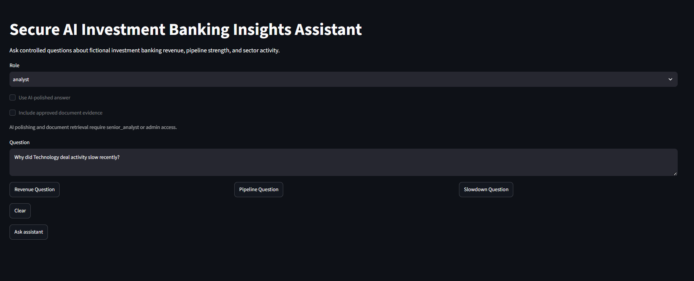
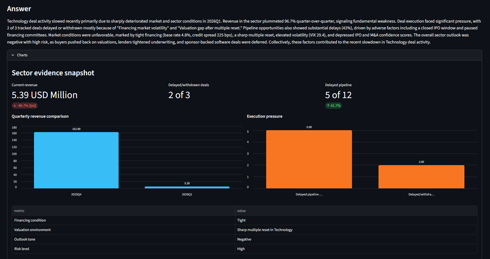
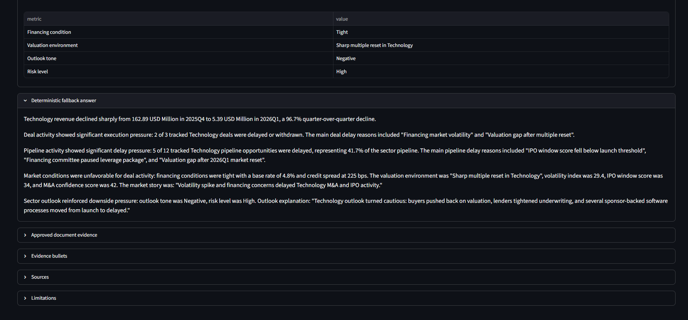

# Secure AI Investment Banking Insights Assistant

## Overview

This project is a secure analytics assistant for a fictional investment bank dataset. It helps answer controlled questions about sector revenue, pipeline strength, deal activity, market conditions, and sector outlook.

The project is educational and portfolio-oriented. All data is synthetic and was produced to simulate a realistic working environment.

The current MVP supports three interview-task questions:

1. Which sectors generated the most revenue in 2025?
2. Why did Technology deal activity slow recently?
3. Compare Healthcare and Industrials pipeline strength.

## What the MVP does

The assistant accepts a natural-language question, routes it to approved tools, gathers structured evidence, and returns an analyst-style answer with sources, limitations, role checks, request IDs, and audit logging.

The user can run it in two modes:

- Deterministic mode: uses only controlled Python logic and templates.
- AI-polished mode: sends approved evidence bullets to OpenAI for cleaner analyst-style wording.

Users with senior analyst role can also include approved document evidence from Markdown and PDF files.

## Demo

The Streamlit interface supports role-based access, deterministic and AI-polished responses, approved document evidence, charts, source traces, limitations, and request-level audit metadata.

### Role-aware interface

The frontend exposes only the capabilities available to the selected role.



### Evidence-backed analyst response

The assistant combines controlled structured evidence with an optional AI-polished summary.



### Explainability and deterministic fallback

Every response retains a deterministic answer and exposes expandable evidence, sources, approved document excerpts, and limitations.



Each request also returns a request ID, answer mode, document-search status, and audit metadata for traceability.

## Installation

Use Windows PowerShell.

Prerequisite: install Python and make sure either `python` or `py` works from PowerShell.

Check:

```powershell
python --version
```

If that does not work, try:

```powershell
py --version
```

Use whichever command works in the setup steps below.

### 1. Open the project folder

```powershell
cd "C:\path\to\Interview Project"
```

### 2. Create and activate a virtual environment

```powershell
python -m venv .venv
```

If your system uses the Windows Python launcher instead:

```powershell
py -m venv .venv
```

```powershell
.\.venv\Scripts\Activate.ps1
```

### 3. Install dependencies

```powershell
python -m pip install -r requirements.txt
```

### 4. Configure environment variables

Copy the example environment file:

```powershell
copy .env.example .env
```

Then open `.env` and replace the placeholder with your real OpenAI API key if you want to use AI-polished answers:

```text
OPENAI_API_KEY=your_real_key_here
```

The deterministic assistant can still run without an OpenAI key.

### 5. Build the SQLite database

The application reads from a local SQLite database generated from the fictional CSV source files.

From the project root, run:

```powershell
python data/scripts/ingest_to_sqlite.py `
  --csv-dir data/csv `
  --db data/ib_fictional_bank.sqlite
```

## Running locally

Start the backend:

```powershell
python -m uvicorn backend.app.main:app --reload
```

Open FastAPI docs:

```text
http://127.0.0.1:8000/docs
```

Start the frontend in a second terminal:

```powershell
streamlit run frontend/app.py
```

Open Streamlit:

```text
http://localhost:8501
```

To access from another device on the same network, use the computer's local network IP address instead of `localhost`.

## Current technical stack

- Python
- FastAPI
- Streamlit
- Pandas
- SQLite
- Pytest
- OpenAI API
- JSON Lines audit logging
- Markdown and PDF document retrieval

## Architecture

```text
Streamlit frontend
    |
    |  question + role + AI toggle + document toggle
    v
FastAPI backend
    |
    +--> Role permission layer
    |       - analyst
    |       - senior_analyst
    |       - admin
    |
    +--> Assistant endpoints
    |       |
    |       +--> question_router_tool
    |       |       - revenue_ranking
    |       |       - pipeline_comparison
    |       |       - sector_analysis
    |       |
    |       +--> analyst_response_tool
    |       |       - deterministic answer
    |       |       - evidence bullets
    |       |       - sources
    |       |       - limitations
    |       |
    |       +--> optional document_retrieval_tool
    |       |       - markdown search
    |       |       - PDF search
    |       |       - approved snippets only
    |       |
    |       +--> optional OpenAI polishing
    |       |       - uses only approved evidence
    |       |       - deterministic fallback if AI fails
    |       |
    |       +--> audit_logger
    |               - request metadata
    |               - status
    |               - answer mode
    |               - document search status
    |
    +--> Protected raw tool endpoints
            |
            +--> revenue_summary_tool
            |       - SQLite read-only query layer
            |       - revenue_by_sector_quarter.csv
            |
            +--> pipeline_comparison_tool
            |       - pipeline_opportunities.csv
            |
            +--> sector_evidence_tool
            |       - revenue, deals, pipeline, market, outlook CSVs
            |
            +--> document_retrieval_tool
                    - approved markdown and PDF documents
```

## Security model

The MVP uses mock role-based access control. Roles are passed as query parameters for learning and demo purposes. This is not production authentication, but it shows where a real authentication layer would connect later.

Current roles:

- `analyst`
- `senior_analyst`
- `admin`

Current permissions:

- `revenue_ranking`
- `pipeline_comparison`
- `sector_analysis`
- `ai_polishing`
- `document_search`

Role permissions:

| Role | Permissions |
| --- | --- |
| `analyst` | `revenue_ranking`, `pipeline_comparison`, `sector_analysis` |
| `senior_analyst` | `revenue_ranking`, `pipeline_comparison`, `sector_analysis`, `ai_polishing`, `document_search` |
| `admin` | all permissions |

Security behavior:

- Invalid role returns `400 Bad Request`.
- Valid role without permission returns `403 Forbidden`.
- Assistant and raw tool endpoints are protected by permission checks.
- AI never receives unrestricted local files or raw database access.
- Document retrieval returns approved snippets, not full unrestricted documents.

## Main endpoints

### Streamlit frontend

File:

- `frontend/app.py`

Run:

```powershell
streamlit run frontend/app.py
```

The frontend includes:

- role selector
- AI-polished answer toggle
- approved document evidence toggle
- example question buttons
- answer display
- charts and tables
- sources and limitations
- request ID display

### Deterministic assistant

```text
GET /api/assistant/ask
```

Parameters:

- `question`
- `role`

Example:

```text
/api/assistant/ask?question=Which sectors generated the most revenue in 2025?&role=analyst
```

### AI-polished assistant

```text
GET /api/assistant/ask-ai
```

Parameters:

- `question`
- `role`
- `include_documents`

Example:

```text
/api/assistant/ask-ai?question=Why did Technology deal activity slow recently?&role=senior_analyst&include_documents=true
```

### Revenue summary

```text
GET /api/revenue/{year}
```

Example:

```text
/api/revenue/2025?role=analyst
```

Returns annual revenue totals by sector, sorted from highest to lowest.

### Pipeline comparison

```text
GET /api/pipeline/compare
```

Example:

```text
/api/pipeline/compare?sector_a=Healthcare&sector_b=Industrials&role=analyst
```

Compares two sectors using:

- opportunity count
- total deal value
- expected fees
- probability-weighted fees
- average probability
- delayed opportunities

### Sector evidence

```text
GET /api/sectors/evidence
```

Example:

```text
/api/sectors/evidence?sector=Technology&quarter=2026Q1&role=analyst
```

Returns five controlled evidence sections:

1. revenue
2. deals
3. pipeline
4. market
5. outlook

### Document search

```text
GET /api/documents/search
```

Example:

```text
/api/documents/search?query=Technology 2026Q1&role=senior_analyst
```

Searches approved markdown and PDF documents. Requires `document_search` permission.

## Supported assistant questions

The MVP router currently supports these question patterns:

- revenue ranking questions
- pipeline comparison questions
- sector analysis questions, including slowdown or weakness questions

Examples:

```text
Which sectors generated the most revenue in 2025?
Compare Healthcare and Industrials pipeline strength.
Why did Technology deal activity slow recently?
```

Unsupported questions return a controlled error instead of allowing unrestricted data access.

## Document retrieval

Document retrieval is optional and currently used by the AI-polished assistant flow.

When `include_documents=true`, the system:

1. Generates a short document search query.
2. Adds deterministic fallback search phrases.
3. Searches approved markdown and PDF documents.
4. Includes only approved snippets in the AI prompt.
5. Returns document search metadata in the API response.

Document search metadata includes:

- enabled/disabled status
- search status
- query used
- attempted queries
- sources
- match count
- snippets
- error message, if relevant

Current limitation: retrieval is keyword-based. It is not semantic search or embeddings yet.

## Audit logging

Audit logs are written as JSON Lines.

File:

```text
data/audit_logs/audit_log.jsonl
```

The audit log stores metadata rather than full answers or full evidence packets.

Tracked fields include:

- request ID
- timestamp
- endpoint
- role
- question
- matched intent
- tool used
- answer mode
- include documents flag
- document search status
- document search query
- required permission
- status
- message

Audited outcomes include:

- successful deterministic assistant requests
- successful AI-polished assistant requests
- validation errors
- permission denials

## Data sources

Structured sources:

- `revenue_by_sector_quarter.csv`
- `pipeline_opportunities.csv`
- `deals.csv`
- `market_conditions.csv`
- `sector_outlook_notes.csv`

Document sources:

- `data_story_map.md`
- `technology_2026q1_market_update.pdf`

## Testing

Run tests from the project root:

```powershell
python -m pytest -q
```

The test suite covers:

- revenue summary logic
- pipeline comparison logic
- sector evidence logic
- document retrieval
- question routing
- deterministic analyst responses
- AI response fallback behavior
- role permissions
- protected API endpoints
- audit logging behavior

## Current MVP limitations

- Roles are passed as query parameters instead of using real authentication.
- The router is deterministic and keyword-based.
- Document retrieval is keyword-based, not semantic.
- The OpenAI layer polishes approved evidence but does not autonomously call tools.
- Data schema is fixed to this fictional dataset.
- Streamlit is a local demo UI, not a deployed production application.
- Audit logging stores request metadata but is not connected to a real compliance system.

## Planned post-MVP improvements:

- Replace query-parameter roles with real authentication.
- Add semantic document retrieval.
- Add AI tool orchestration with strict tool permissions.
- Support more question types.
- Add configurable data-source mappings for company-specific deployments.
- Add production deployment instructions.
